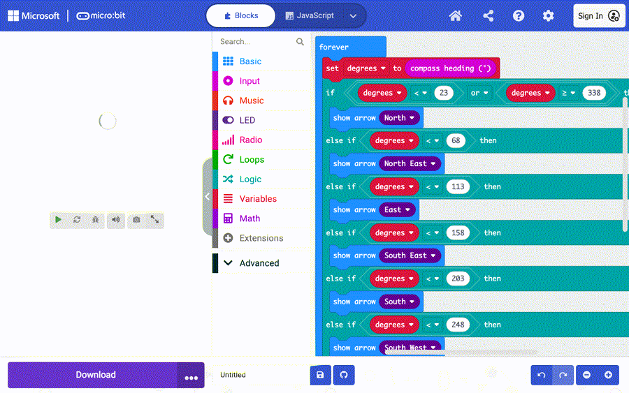
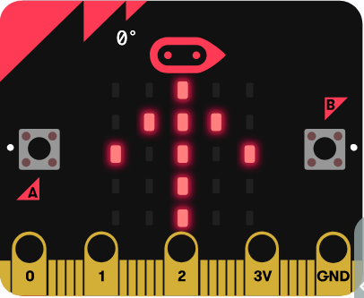
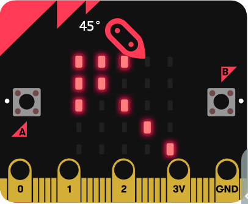
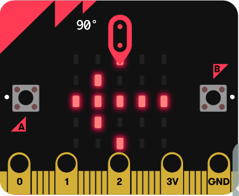
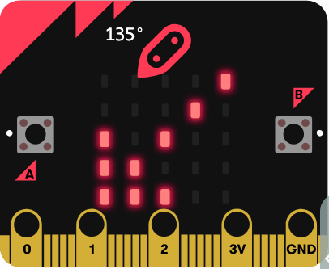
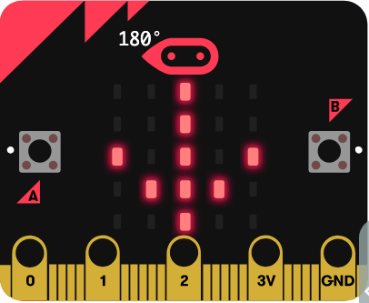
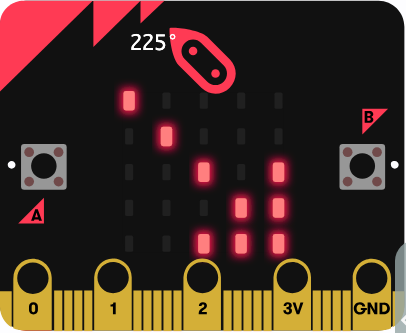
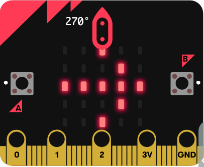
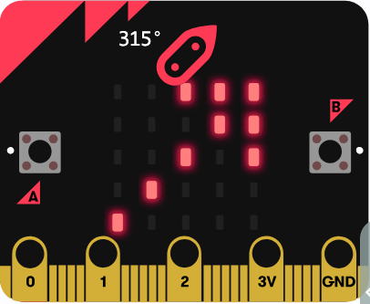
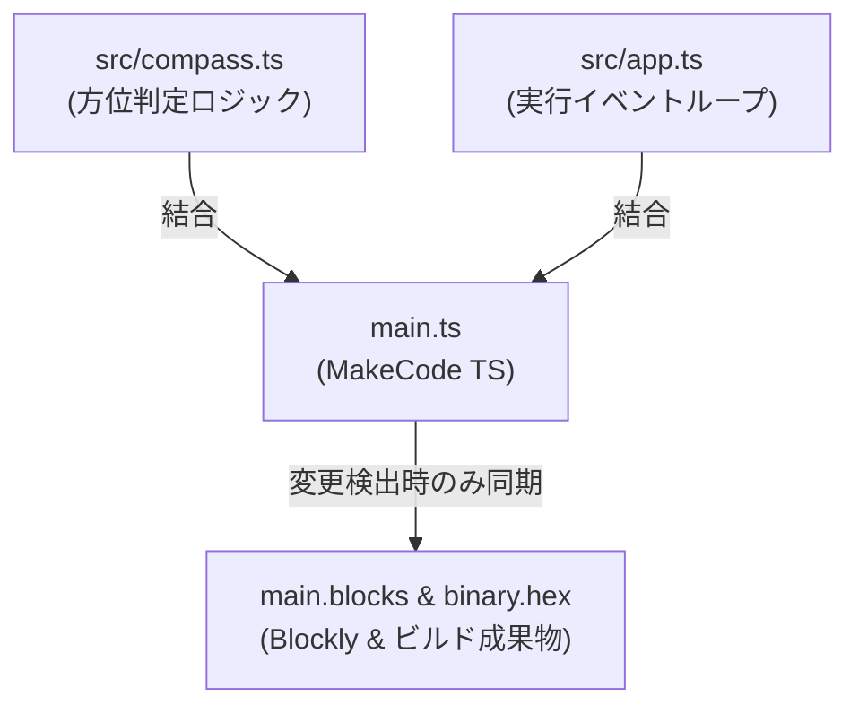

# Compass (方位磁石)

micro:bit で動く 8 方向方位磁石（コンパス）アプリケーションです。取得した角度（0°〜359°）に応じて、LED マトリクス上に 8 方向（北・北東・東・南東・南・南西・西・北西）の標準矢印アイコン（`ArrowNames`）を表示します。

---

## 📋 目次 (TOC)

- [🎬 操作デモ](#-操作デモ)
- [🧭 仕様・8方向判定ロジック](#specification)
- [📸 8方向矢印表示パターン](#display-patterns)
- [📁 ディレクトリ構成](#directory-structure)
- [🛠️ 開発・ビルド手順](#development-and-build)
  - [1. 依存パッケージのインストール](#1-依存パッケージのインストール)
  - [2. ローカル開発サーバーの起動](#2-ローカル開発サーバーの起動)
  - [3. プロジェクトのビルド](#3-プロジェクトのビルド)
  - [4. main.ts / main.blocks の自動同期メカニズム](#4-maint--mainblocks-の自動同期メカニズム)
  - [5. スクリーンショットおよびデモ GIF の生成](#5-スクリーンショットおよびデモ-gif-の生成)
- [🧪 テスト・検証実行方法](#testing)
  - [1. ユニットテスト実行 (Vitest)](#1-ユニットテスト実行-vitest)
  - [2. E2E テスト実行 (Playwright)](#2-e2e-テスト実行-playwright)
- [📊 カバレッジ計測結果表示方法](#coverage)
- [🤖 AI Agent スキルの活用プロンプト例](#ai-agent-prompts)

---

## 🎬 操作デモ



---

## <a id="specification"></a>🧭 仕様・8方向判定ロジック

本アプリケーションは、デバイスがどの方向を向いていても **常に「物理的な北」を指し示す** 本物のコンパス（方位磁石）として動作します。
`input.compassHeading()` で取得したデバイスの角度（`degrees`: `0` 〜 `359`）から、北の方角の相対角度（`northHeading = (360 - degrees) % 360`）を算出し、以下の 8 方向の矢印を出力します。

### 北の相対角度（`northHeading`）の判定基準

| 角度範囲 (deg) | 方角 | 表示矢印アイコン (`ArrowNames`) |
|---|---|---|
| `338` <= deg < `23` (338°〜22°) | 北 (North) | `ArrowNames.North` |
| `23` <= deg < `68` (23°〜67°) | 北東 (NorthEast) | `ArrowNames.NorthEast` |
| `68` <= deg < `113` (68°〜112°) | 東 (East) | `ArrowNames.East` |
| `113` <= deg < `158` (113°〜157°) | 南東 (SouthEast) | `ArrowNames.SouthEast` |
| `158` <= deg < `203` (158°〜202°) | 南 (South) | `ArrowNames.South` |
| `203` <= deg < `248` (203°〜247°) | 南西 (SouthWest) | `ArrowNames.SouthWest` |
| `248` <= deg < `293` (248°〜292°) | 西 (West) | `ArrowNames.West` |
| `293` <= deg < `338` (293°〜337°) | 北西 (NorthWest) | `ArrowNames.NorthWest` |

---

## <a id="display-patterns"></a>📸 8方向矢印表示パターン

デバイス（micro:bit）の向きに応じた、LED マトリクス上の矢印表示パターン（北を指す方向）の一覧です。

| デバイスの向き: 北 (0°) | デバイスの向き: 北東 (45°) | デバイスの向き: 東 (90°) | デバイスの向き: 南東 (135°) |
|:---:|:---:|:---:|:---:|
|  |  |  |  |
| 指す方角: **北** (`ArrowNames.North`) | 指す方角: **北西** (`ArrowNames.NorthWest`) | 指す方角: **西** (`ArrowNames.West`) | 指す方角: **南西** (`ArrowNames.SouthWest`) |

| デバイスの向き: 南 (180°) | デバイスの向き: 南西 (225°) | デバイスの向き: 西 (270°) | デバイスの向き: 北西 (315°) |
|:---:|:---:|:---:|:---:|
|  |  |  |  |
| 指す方角: **南** (`ArrowNames.South`) | 指す方角: **南東** (`ArrowNames.SouthEast`) | 指す方角: **東** (`ArrowNames.East`) | 指す方角: **北東** (`ArrowNames.NorthEast`) |

---

## <a id="directory-structure"></a>📁 ディレクトリ構成

```text
compass/
├── main.ts              <-- メインプログラムコード (MakeCode PXT 用・自動生成対象)
├── main.blocks          <-- ブロックエディタ用の同期ファイル (Blockly XML)
├── pxt.json             <-- PXT プロジェクト設定ファイル
├── sync-config.json     <-- 同期スキルの除外設定・エントリーポイント定義ファイル
├── src/
│   ├── compass.ts       <-- 方位判定ロジック関数 (モジュール設計)
│   └── app.ts           <-- アプリケーションのエントリーコード (Single Source of Truth 結合対象)
├── scripts/
│   ├── capture_screenshots.ts <-- 代表方位パターンの画像取得スクリプト
│   └── capture_demo_frames.ts <-- デモ GIF・フレーム画像の自動取得スクリプト
├── screenshots/
│   ├── demo.gif         <-- 8方向回転デモ GIF アニメーション
│   ├── 00_north_0deg.png ... <-- 代表方位パターン画像
│   └── frames/          <-- 8方向回転アニメーション用フレーム画像
├── test/
│   ├── unit/
│   │   └── compass.test.ts  <-- Vitest ユニットテスト (カバレッジ 100%)
│   └── e2e/
│       └── compass.spec.ts  <-- Playwright E2E シミュレータテスト
└── README.md            <-- 本ドキュメント
```

---

## <a id="development-and-build"></a>🛠️ 開発・ビルド手順

### 1. 依存パッケージのインストール

```bash
npm install
```

### 2. ローカル開発サーバーの起動

MakeCode のブロックエディタをローカルで起動して開発・確認を行えます。起動前に自動的にコード同期が検証されます。

```bash
npm run serve
```

### 3. プロジェクトのビルド

`src/` 配下のソースコードの変更を自動同期し、micro:bit 実機や MakeCode エディタへインポートするための `.hex` ファイルを作成します。

```bash
npm run build
```
ビルド完了後、`built/binary.hex` が生成されます。

### 4. main.ts / main.blocks の自動同期メカニズム

本プロジェクトでは `src/` 配下の TypeScript モジュールとエントリーコード（`src/app.ts`）が **唯一の正 (Single Source of Truth)** です。



`npm test`, `npm run build`, `npm run serve` などのコマンド実行直前に、グローバル共有スキルである `microbit-pxt-sync` 内の同期スクリプトが全自動で起動します。
* `src/` 内のファイルに変更がない通常時は、**数ミリ秒の高速判定** で通過します。
* 変更が検知された場合のみ、`main.ts` が自動生成・マージされ、Playwright 経由で `main.blocks` および `built/binary.hex` が一括で最新化されます。
* 競合定義の除外やエントリーポイントの指定は、プロジェクト直下の `sync-config.json` で制御されています。

### 5. スクリーンショットおよびデモ GIF の生成

MakeCode シミュレータから最新の画像および 8 方向回転 GIF アニメーションを生成できます。

```bash
# 代表画像の撮影
npm run screenshots

# 8方向回転デモ GIF アニメーションの再生成
npm run screenshots:gif
```

---

## <a id="testing"></a>🧪 テスト・検証実行方法

### 1. ユニットテスト実行 (Vitest)

全 8 方向の分岐網羅単体テストを実行し、コードカバレッジを測定します（事前に同期が自動実行されます）。

```bash
npm test
```
または
```bash
npm run test:unit
```

### 2. E2E テスト実行 (Playwright)

Playwright を用いて MakeCode シミュレータ上での動的表示テストを実行します。

```bash
npm run test:e2e
```

---

## <a id="coverage"></a>📊 カバレッジ計測結果表示方法

`npm test`（または `npm run coverage`）を実行すると、ターミナル上に 100% カバレッジ結果が表示されます。

```text
 % Coverage report from v8
------------|---------|----------|---------|---------|-------------------
File        | % Stmts | % Branch | % Funcs | % Lines | Uncovered Line #s 
------------|---------|----------|---------|---------|-------------------
All files   |     100 |      100 |     100 |     100 |                   
 compass.ts |     100 |      100 |     100 |     100 |                   
------------|---------|----------|---------|---------|-------------------
```

- **Mac で HTML カバレッジレポートを開く場合**:
  ```bash
  open coverage/index.html
  ```

---

## <a id="ai-agent-prompts"></a>🤖 AI Agent スキルの活用プロンプト例

### 1. 簡素な例 (ワンライナー指示)

- **ブロック互換性チェック**: `microbit-block-reviewer` で `main.ts` の互換性を検証して
- **ビルド＆エディタ表示**: `microbit-build-and-open` で `.hex` をビルドし MakeCode で開いて
- **シミュレータ検証**: `microbit-sim-tester` で動かして LED 表示のスクショを撮って

### 2. 詳細な例 (条件・目的を明確にした指示)

- **ブロック互換性チェック**:
  > `main.ts` および `src/compass.ts` について、MakeCode ブロックエディタで非対応となる構文やグレーブロックになる記述がないか `microbit-block-reviewer` スキルで検証し、改善案を提示してください。

- **ビルド＆エディタ表示**:
  > `npm run build` を実行して `built/binary.hex` を生成し、`microbit-build-and-open` スキルを使って MakeCode エディタに読み込ませて開発環境を準備してください。

- **シミュレータ検証**:
  > `microbit-sim-tester` スキルを使って MakeCode シミュレータ上で方位（0°, 90°, 180°, 270°）を設定し、LED マトリクス上の矢印表示をスクリーンショット撮影して結果を検証してください。
