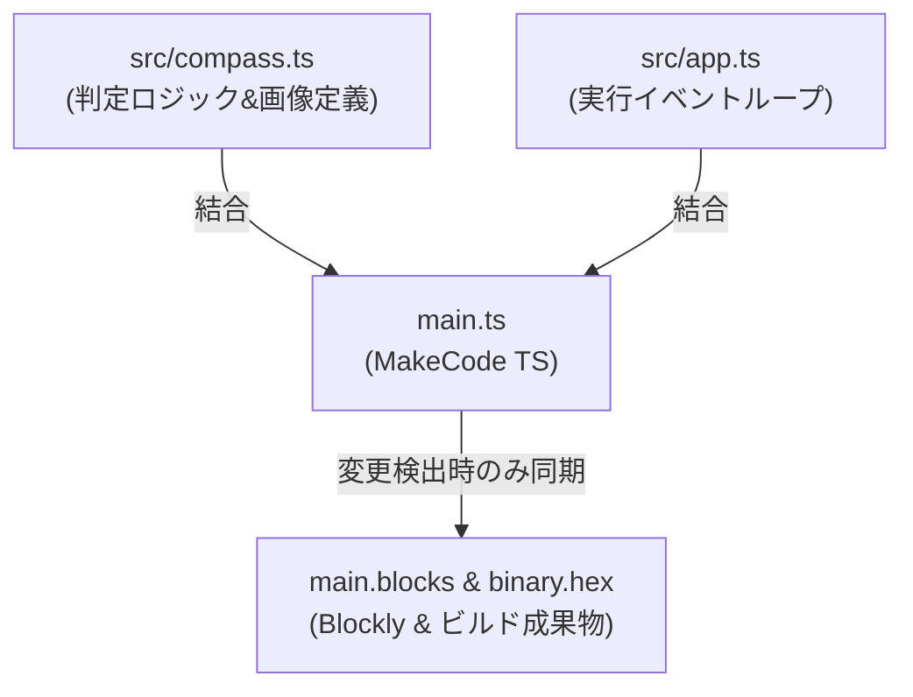

# Compass16 (16方向方位磁石)

micro:bit で動く 16 方向方位磁石（コンパス）アプリケーションです。取得した角度（0°〜359°）に応じて、LED マトリクス上に 16 方向のカスタム矢印アイコンを表示します。

---

## 📋 目次 (TOC)

- [🎬 操作デモ](#-操作デモ)
- [🧭 仕様・16方向判定ロジック](#specification)
- [📸 16方向矢印表示パターン](#display-patterns)
- [📁 ディレクトリ構成](#directory-structure)
- [🛠️ 開発・ビルド手順](#development-and-build)
  - [1. 依存パッケージのインストール](#1-依存パッケージのインストール)
  - [2. ローカル開発サーバーの起動](#2-ローカル開発サーバーの起動)
  - [3. プロジェクトのビルド](#3-プロジェクトのビルド)
  - [4. main.ts / main.blocks の自動同期メカニズム](#4-maint--mainblocks-の自動同期メカニズム)
- [🧪 テスト・検証実行方法](#testing)
  - [1. ユニットテスト実行 (Vitest)](#1-ユニットテスト実行-vitest)

---

## 🎬 操作デモ


---

## <a id="specification"></a>🧭 仕様・16方向判定ロジック

micro:bit本体がどの方向を向いていても、**常に「北（真の北）」を指し示すコンパス**として動作するように、取得した角度（`0` 〜 `359`）から逆回転の矢印を出力します。

16方向を 22.5° 刻みで判定し、本体の向きに応じて以下のインデックスの矢印を表示します。配列 `arrows_array` を反時計回りの順序で配置することで、取得したインデックス（時計回り方向）と反時計回りのインデックスが一致し、シンプルなコードで常に北を指し示します。

なお、本アプリは標準の8方向（N, NW, W, SW, S, SE, E, NE）には micro:bit 組み込みの `images.arrowImage` を使用し、その中間方位の8方向（NNW, WNW, WSW, SSW, SSE, ESE, ENE, NNE）を `images.createImage` によるカスタムパターンで描画するハイブリッド構成を採用しています。

| micro:bit本体の角度範囲 (deg) | 本体が向いている方角 | 表示矢印イメージ（配列インデックスと方向） | 説明（北を指すための方向） |
|---|---|---|---|
| `348.75` <= deg < `11.25` | 北 (North) | index 0: `N` | 北は正面 |
| `11.25` <= deg < `33.75` | 北北東 (NorthNorthEast) | index 1: `NNW` | 北は左に22.5°傾いた方向 |
| `33.75` <= deg < `56.25` | 北東 (NorthEast) | index 2: `NW` | 北は左斜め前 |
| `56.25` <= deg < `78.75` | 東北東 (EastNorthEast) | index 3: `WNW` | 北は左に67.5°傾いた方向 |
| `78.75` <= deg < `101.25` | 東 (East) | index 4: `W` | 北は左 |
| `101.25` <= deg < `123.75` | 東南東 (EastSouthEast) | index 5: `WSW` | 北は左に112.5°傾いた方向 |
| `123.75` <= deg < `146.25` | 南東 (SouthEast) | index 6: `SW` | 北は左斜め後ろ |
| `146.25` <= deg < `168.75` | 南南東 (SouthSouthEast) | index 7: `SSW` | 北は左に157.5°傾いた方向 |
| `168.75` <= deg < `191.25` | 南 (South) | index 8: `S` | 北は真後ろ |
| `191.25` <= deg < `213.75` | 南南西 (SouthSouthWest) | index 9: `SSE` | 北は右に157.5°傾いた方向 |
| `213.75` <= deg < `236.25` | 南西 (SouthWest) | index 10: `SE` | 北は右斜め後ろ |
| `236.25` <= deg < `258.75` | 西南西 (WestSouthWest) | index 11: `ESE` | 北は右に112.5°傾いた方向 |
| `258.75` <= deg < `281.25` | 西 (West) | index 12: `E` | 北は右 |
| `281.25` <= deg < `303.75` | 西北西 (WestNorthWest) | index 13: `ENE` | 北は右に67.5°傾いた方向 |
| `303.75` <= deg < `326.25` | 北西 (NorthWest) | index 14: `NE` | 北は右斜め前 |
| `326.25` <= deg < `348.75` | 北北西 (NorthNorthWest) | index 15: `NNE` | 北は右に22.5°傾いた方向 |

### 🛠️ 判定アルゴリズム (四捨五入と剰余による簡素化)

`Math.round(degrees / 22.5) % 16` の計算により、22.5° 刻みの16方向判定を剰余演算のみでシンプルに解決しています。

```typescript
export function getDirectionIndex(degrees: number): number {
    // 角度を [0, 360) の範囲に正規化（負の角度や 360度以上の値にも対応）
    const normalized = ((degrees % 360) + 360) % 360;
    // 22.5度刻みで四捨五入し、16等分したインデックスを求める
    return Math.round(normalized / 22.5) % 16;
}
```

---

## <a id="display-patterns"></a>📸 16方向矢印表示パターン

| 北 (0°) | 北北東 (22.5°) | 北東 (45°) | 東北東 (67.5°) |
|:---:|:---:|:---:|:---:|
|  |  |  |  |
| index 0: `N` | index 1: `NNW` | index 2: `NW` | index 3: `WNW` |

| 東 (90°) | 東南東 (112.5°) | 南東 (135°) | 南南東 (157.5°) |
|:---:|:---:|:---:|:---:|
|  |  |  |  |
| index 4: `W` | index 5: `WSW` | index 6: `SW` | index 7: `SSW` |

| 南 (180°) | 南南西 (202.5°) | 南西 (225°) | 西南西 (247.5°) |
|:---:|:---:|:---:|:---:|
|  |  |  |  |
| index 8: `S` | index 9: `SSE` | index 10: `SE` | index 11: `ESE` |

| 西 (270°) | 西北西 (292.5°) | 北西 (315°) | 北北西 (337.5°) |
|:---:|:---:|:---:|:---:|
|  |  |  |  |
| index 12: `E` | index 13: `ENE` | index 14: `NE` | index 15: `NNE` |

---

## <a id="directory-structure"></a>📁 ディレクトリ構成

```text
compass16/
├── main.ts              <-- メインプログラムコード (MakeCode PXT 用・自動生成対象)
├── main.blocks          <-- ブロックエディタ用の同期ファイル (Blockly XML)
├── pxt.json             <-- PXT プロジェクト設定ファイル
├── sync-config.json     <-- 同期スキルの除外設定・エントリーポイント定義ファイル
├── src/
│   ├── compass.ts       <-- 16方向判定ロジックと矢印パターン (モジュール設計)
│   └── app.ts           <-- アプリケーションのエントリーコード (Single Source of Truth 結合対象)
├── test/
│   └── unit/
│       └── compass.test.ts  <-- Vitest ユニットテスト (カバレッジ 100%)
└── README.md            <-- 本ドキュメント
```

---

## <a id="development-and-build"></a>🛠️ 開発・ビルド手順

### 1. 依存パッケージのインストール

```bash
npm install
```

### 2. ローカル開発サーバーの起動

MakeCode のブロックエディタをローカルで起動して開発・確認を行えます。起動前に自動的にコード同期が検証されます。

```bash
npm run serve
```

### 3. プロジェクトのビルド

`src/` 配下のソースコードの変更を自動同期し、micro:bit 実機や MakeCode エディタへインポートするための `.hex` ファイルを作成します。

```bash
npm run build
```
ビルド完了後、`built/binary.hex` が生成されます。

### 4. main.ts / main.blocks の自動同期メカニズム

本プロジェクトでは `src/` 配下の TypeScript モジュールとエントリーコード（`src/app.ts`）が **唯一の正 (Single Source of Truth)** です。



`npm test`, `npm run build`, `npm run serve` などのコマンド実行直前に、グローバル共有スキルである `microbit-pxt-sync` 内の同期スクリプトが全自動で起動します。

---

## <a id="testing"></a>🧪 テスト・検証実行方法

### 1. ユニットテスト実行 (Vitest)

全 16 方向の分岐網羅単体テストを実行し、コードカバレッジを測定します（事前に同期が自動実行されます）。

```bash
npm test
```
または
```bash
npm run test:unit
```

---

## 開発ガイドライン

詳細な開発ガイドライン、コーディング規約、開発時の注意については、以下を参照してください：

- [`CLAUDE.md`](CLAUDE.md) - 本プロジェクトの固有情報（仕様、16方向判定、ハイブリッド矢印、開発上の注意）
- [`../CLAUDE.md`](../CLAUDE.md) - プロジェクト全体の開発ガイドライン（ビルド・テスト手順、ツール設定、コーディング規約）
