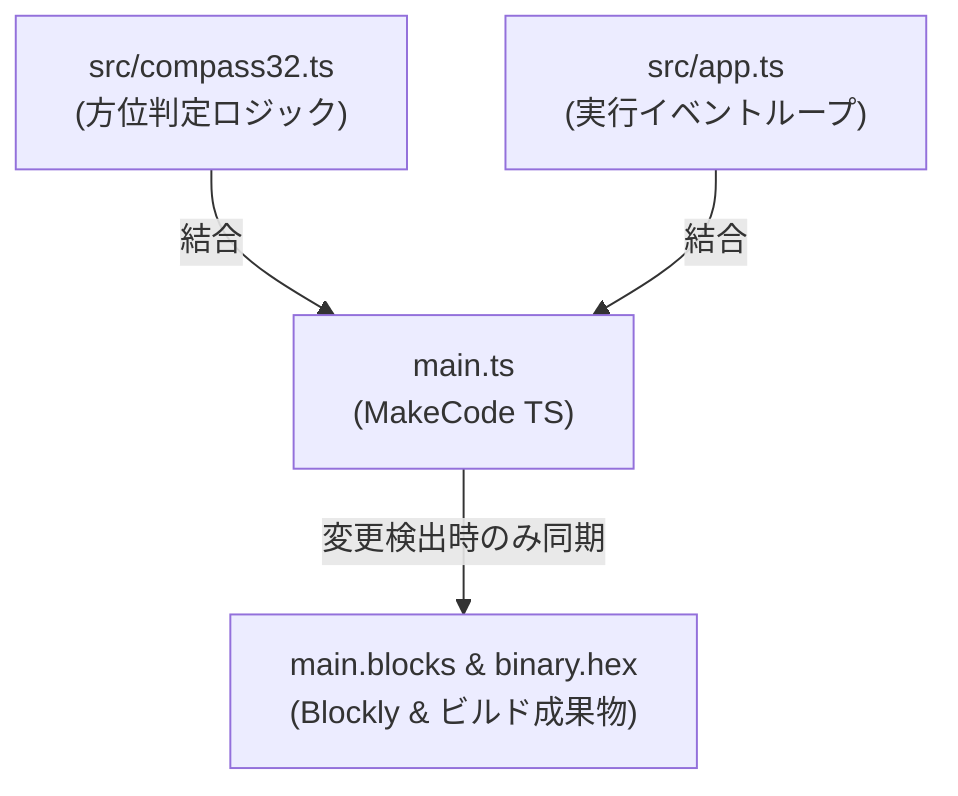

# Compass32 (32方向 高精度方位磁石)

micro:bit で動く 32 方向（高精度）方位磁石（コンパス）アプリケーションです。取得した角度（0°〜359°）に応じて、LED マトリクス上に先端（対向する外周点）と後端を結ぶ 32 通りの独自の直線グラフィックを表示します。

---

## 📋 目次 (TOC)

- [🎬 操作デモ](#-操作デモ)
- [🧭 仕様・32方向アルゴリズム](#specification)
- [📸 真北 (0°) 〜 北東 (45°) 表示パターン](#display-patterns)
- [📁 ディレクトリ構成](#directory-structure)
- [🛠️ 開発・ビルド手順](#development-and-build)
  - [1. 依存パッケージのインストール](#1-依存パッケージのインストール)
  - [2. ローカル開発サーバーの起動](#2-ローカル開発サーバーの起動)
  - [3. プロジェクトのビルド](#3-プロジェクトのビルド)
  - [4. main.ts / main.blocks の自動同期メカニズム](#4-maint--mainblocks-の自動同期メカニズム)
- [🧪 テスト・検証実行方法](#testing)
  - [1. コード品質チェック (ESLint)](#1-コード品質チェック-eslint)
  - [2. ユニットテスト実行 (Vitest)](#2-ユニットテスト実行-vitest)
  - [3. E2E テスト実行 (Playwright)](#3-e2e-テスト実行-playwright)
- [📊 カバレッジ計測結果表示方法](#coverage)
- [🤖 AI Agent スキルの活用プロンプト例](#ai-agent-prompts)

---

## 🎬 操作デモ


---

## <a id="specification"></a>🧭 仕様・32方向アルゴリズム

5x5 LED マトリクスの最外周上の「先端 $A$」と「対向する反対側の辺上の点 $B$」を結ぶ直線ベクトル（全 32 パターン）を利用し、約 11.25° 刻みで 360° を高精度に表示します。

> 💡 **メモリ最適化（座標のパック化）**  
> メモリ効率の向上のため、各点の座標 $(x, y)$ は10進数2桁の数値（$10x + y$、例: $(2,0) \rightarrow 20$, $(2,4) \rightarrow 24$）にパックされ、`number[][]` 形式のデータとして保持されています。描画時に $x = \lfloor val / 10 \rfloor$, $y = val \pmod{10}$ として展開し復元されます。

> 💡 **先端・後端の識別表現**  
> 矢印の先端 $A$（進行方向）が最も明るく輝き、後端 $B$（尾部）に向かって段階的に明るさを減衰させる **輝度グラデーション表示（`led.plotBrightness`）** を採用しています。  
> 先端 $A$（100% 輝度） $\rightarrow$ 胴体 $\rightarrow$ 後端 $B$（約 10% 輝度）

| インデックス | 代表角度 (度) | 先端座標 $A$ | 後端座標 $B$ | 主な方位 |
|---|---|---|---|---|
| 0 | 0.00° | (2,0) | (2,4) | 北 (North) |
| 1 | 14.04° | (3,0) | (2,4) | 北北東微東 |
| 2 | 26.57° | (4,0) | (2,4) | 北北東 |
| 3 | 36.87° | (4,0) | (1,4) | 北東微北 |
| 4 | 45.00° | (4,0) | (0,4) | 北東 (NorthEast) |
| 8 | 90.00° | (4,2) | (0,2) | 東 (East) |
| 12 | 135.00° | (4,4) | (0,0) | 南東 (SouthEast) |
| 16 | 180.00° | (2,4) | (2,0) | 南 (South) |
| 20 | 225.00° | (0,4) | (4,0) | 南西 (SouthWest) |
| 24 | 270.00° | (0,2) | (4,2) | 西 (West) |
| 28 | 315.00° | (0,0) | (4,4) | 北西 (NorthWest) |

### 💡 ブレゼンハムのアルゴリズムを用いた動的描画の検討

現在の方位磁石（矢印）の表示は、32方向それぞれの5つのドットデータを予め配列テーブル（`DIRECTION_POINTS`）としてハードコードして呼び出しています。これに対し、「先端」と「後端」の2つの端点のみを定義し、中間の点は**ブレゼンハムのラインアルゴリズム (Bresenham's line algorithm)** を用いてリアルタイムに計算・補完して描画するアプローチも検討可能です。

#### メリットと可能性
1. **データ量の削減**: 32方向 × 5点 = 160バイトのテーブルから、32方向 × 2端点 = 64バイトに削減（約60%削減）できます。
2. **任意の角度（360度）への拡張**: 三角関数（`Math.sin` / `Math.cos`）でコンパスの角度から直接2つの端点を動的計算し、その間を本アルゴリズムで補間することで、32方向に制限されない「360度シームレスに回転する方位磁針」にアップグレードできます。

#### デメリットと技術的課題
1. **5x5 LEDにおける視覚的調整の限界**: 5x5という極めて粗い解像度では、自動計算された直線が「必ず中心点 (2, 2) を通るか」や「人間の目から見て自然な直線（矢印）に見えるか」というデザイン上の微調整（現在のテーブルに含まれる手動チューニング）が難しくなります。
2. **コードフットプリントの相殺**: 中間点を補間するロジック（十数行のTypeScriptコード）をプログラムに追加する必要があるため、削減されたデータ量（96バイト）に対してプログラムのバイナリサイズは相殺または微増する可能性があります。

#### 🔍 「360度シームレス」における物理的な描画限界数
「360度シームレスな対応」とは、画面上に360種類の異なる形の直線を描画できるという意味ではありません。5x5 LEDという極めて粗い解像度において、物理的に表現できる直線（矢印）のパターンには以下の通り厳然たる上限があります。

1. **完全に対称な直線（中心 (2, 2) を通る場合）**: 外周の16ドットを点対称で結ぶペアは 8 組（8本の線分）しかありません。矢印の向き（正逆の2通り）を考慮しても、物理的な表示パターンは **16種類（16方向）** が限界です。
2. **非対称な直線（中心のズレや端点の偏りを許容する場合）**: 先端（外周16点）に対し、後端の候補を対向する数点に広げて組み合わせた場合、ブレゼンハムで生成されるユニークなパターンは重複を除くと **最大でも 32〜64種類程度** に収束します。

したがって、「360度シームレスに対応」とは、「表示パターンが360個に増える」ことではなく、**「中間の表示データテーブルを固定数で手動定義する限界を排除し、5x5 LEDが持つ表現限界（最大64種程度）の範囲内で、アルゴリズムがその角度に最も近いパターンを動的に自動選択・描画できるようになる」** という本質を意味します。

---

## <a id="display-patterns"></a>📸 真北 (0°) 〜 北東 (45°) 表示パターン

真北（0°）から北東（45°）までのおよそ 11.25° 刻みの矢印表示パターン一覧です。

| 0° (真北) | 14° (北14°) | 27° (北27°) | 37° (北37°) | 45° (北東) |
|:---:|:---:|:---:|:---:|:---:|
|  |  |  |  |  |
| インデックス 0 | インデックス 1 | インデックス 2 | インデックス 3 | インデックス 4 |

---

## <a id="directory-structure"></a>📁 ディレクトリ構成

```text
compass32/
├── main.ts              <-- メインプログラムコード (MakeCode PXT 用・自動生成対象)
├── main.blocks          <-- ブロックエディタ用の同期ファイル (Blockly XML)
├── pxt.json             <-- PXT プロジェクト設定ファイル
├── src/
│   ├── compass32.ts     <-- 32方向判定ロジック & 描画データ
│   └── app.ts           <-- アプリケーションのエントリーコード (Single Source of Truth 結合対象)
├── scripts/
│   ├── capture_screenshots.ts <-- 静止画スクリーンショットの取得
│   └── capture_demo_frames.ts <-- デモ GIF 用全 32 方向フレームの取得
├── screenshots/
│   ├── demo.gif         <-- 32方向回転デモ GIF アニメーション
│   └── 00_north_0deg.png ... <-- 代表方位パターン画像
├── test/
│   ├── unit/
│   │   └── compass32.test.ts <-- Vitest ユニットテスト (カバレッジ 100%)
│   └── e2e/
│       └── compass32.spec.ts <-- Playwright E2E シミュレータテスト
└── README.md            <-- 本ドキュメント
```

---

## <a id="development-and-build"></a>🛠️ 開発・ビルド手順

### 1. 依存パッケージのインストール

```bash
npm install
```

さらに、ローカルビルド環境の初期化のために以下を実行します：

```bash
npx pxt target microbit
npx pxt install
```

### 2. ローカル開発サーバーの起動

MakeCode のブロックエディタをローカルで起動して開発・確認を行えます。起動前に自動的にコード同期が検証されます。

```bash
npm run serve
```

### 3. プロジェクトのビルド

`src/compass32.ts` の変更を自動同期し、micro:bit 実機や MakeCode エディタへインポートするための `.hex` ファイルを作成します。

```bash
npm run build
```
ビルド完了後、`built/binary.hex` が生成されます。

### 4. main.ts / main.blocks の自動同期メカニズム

本プロジェクトでは `src/` 配下の TypeScript モジュールとエントリーコード（`src/app.ts`）が **唯一の正 (Single Source of Truth)** です。



`npm test`, `npm run build`, `npm run serve` などのコマンド実行直前に、グローバル共有スキルである `microbit-pxt-sync` 内の同期スクリプトが全自動で起動します。
* `src/` 内のファイルに変更がない通常時は、**数ミリ秒の高速判定** で通過します。
* 変更が検知された場合のみ、`main.ts` が自動生成・マージされ、Playwright 経由で `main.blocks` および `built/binary.hex` が一括で最新化されます。

### 5. スクリーンショットおよびデモ GIF の生成

MakeCode シミュレータから最新の画像および 32 方向回転 GIF アニメーションを生成できます。

```bash
# 代表目的画像の撮影
npm run screenshots

# 32方向回転デモ GIF アニメーションの再生成
npm run screenshots:gif
```

---

## <a id="testing"></a>🧪 テスト・検証実行方法

### 1. コード品質チェック (ESLint)

TypeScript および JavaScript ファイルの構文・スタイルの検証を行います。

```bash
npx eslint .
```

### 2. ユニットテスト実行 (Vitest)

全 32 方向の分岐網羅単体テストを実行し、コードカバレッジを測定します（事前に同期が自動実行されます）。

```bash
npm test
```

### 3. E2E テスト実行 (Playwright)

MakeCode シミュレータ上での動的表示テストを実行します。

```bash
npm run test:e2e
```

---

## <a id="coverage"></a>📊 カバレッジ計測結果表示方法

`npm test`（または `npm run coverage`）を実行すると、ターミナル上に 100% カバレッジ結果が表示されます。

- **Mac で HTML カバレッジレポートを開く場合**:
  ```bash
  open coverage/index.html
  ```

---

## <a id="ai-agent-prompts"></a>🤖 AI Agent スキルの活用プロンプト例

### 1. 簡素な例 (ワンライナー指示)

- **ブロック互換性チェック**: `microbit-block-reviewer` で `main.ts` の互換性を検証して
- **ビルド＆エディタ表示**: `microbit-build-and-open` で `.hex` をビルドし MakeCode で開いて
- **シミュレータ検証**: `microbit-sim-tester` で動かして LED 表示のスクショを撮って

### 2. 詳細な例 (条件・目的を明確にした指示)

- **ブロック互換性チェック**:
  > `main.ts` および `src/compass32.ts` について、MakeCode ブロックエディタで非対応となる構文やグレーブロックになる記述がないか `microbit-block-reviewer` スキルで検証し、改善案を提示してください。

- **ビルド＆エディタ表示**:
  > `npm run build` を実行して `built/binary.hex` を生成し、`microbit-build-and-open` スキルを使って MakeCode エディタに読み込ませて開発環境を準備してください。

- **シミュレータ検証**:
  > `microbit-sim-tester` スキルを使って MakeCode シミュレータ上で方位（0°, 90°, 180°, 270°）を設定し、LED マトリクス上の矢印表示をスクリーンショット撮影して結果を検証してください。

---

## 開発ガイドライン

詳細な開発ガイドライン、コーディング規約、開発時の注意については、以下を参照してください：

- [`CLAUDE.md`](CLAUDE.md) - 本プロジェクトの固有情報（仕様、32方向判定、座標パック、輝度グラデーション、開発上の注意）
- [`../CLAUDE.md`](../CLAUDE.md) - プロジェクト全体の開発ガイドライン（ビルド・テスト手順、ツール設定、コーディング規約）
