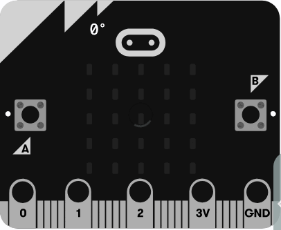
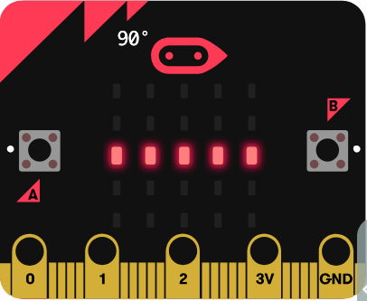
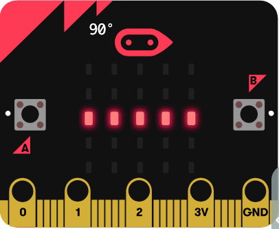
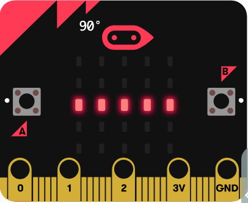
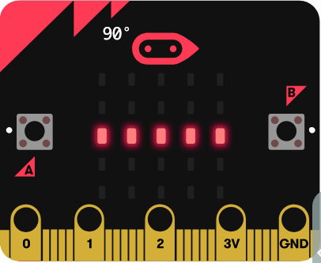
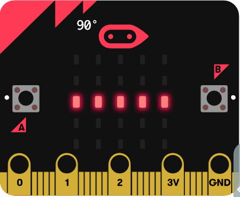
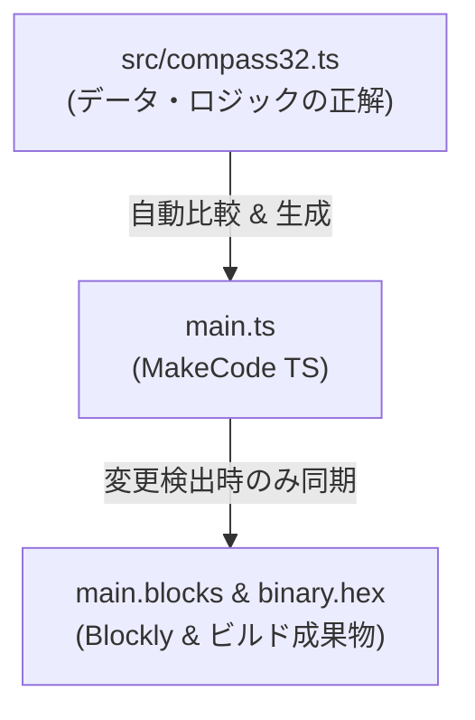

# Compass32 (32方向 高精度方位磁石)

micro:bit で動く 32 方向（高精度）方位磁石（コンパス）アプリケーションです。取得した角度（0°〜359°）に応じて、LED マトリクス上に先端（対向する外周点）と後端を結ぶ 32 通りの独自の直線グラフィックを表示します。

---

## 📋 目次 (TOC)

- [🎬 操作デモ](#-操作デモ)
- [🧭 仕様・32方向アルゴリズム](#specification)
- [📸 真北 (0°) 〜 北東 (45°) 表示パターン](#display-patterns)
- [📁 ディレクトリ構成](#directory-structure)
- [🛠️ 開発・ビルド手順](#development-and-build)
  - [1. 依存パッケージのインストール](#1-依存パッケージのインストール)
  - [2. ローカル開発サーバーの起動](#2-ローカル開発サーバーの起動)
  - [3. プロジェクトのビルド](#3-プロジェクトのビルド)
  - [4. main.ts / main.blocks の自動同期メカニズム](#4-maint--mainblocks-の自動同期メカニズム)
- [🧪 テスト実行方法](#testing)
  - [1. ユニットテスト実行 (Vitest)](#1-ユニットテスト実行-vitest)
  - [2. E2E テスト実行 (Playwright)](#2-e2e-テスト実行-playwright)
- [📊 カバレッジ計測結果表示方法](#coverage)
- [🤖 AI Agent スキルの活用プロンプト例](#ai-agent-prompts)

---

## 🎬 操作デモ



---

## <a id="specification"></a>🧭 仕様・32方向アルゴリズム

5x5 LED マトリクスの最外周上の「先端 $A$」と「対向する反対側の辺上の点 $B$」を結ぶ直線ベクトル（全 32 パターン）を利用し、約 11.25° 刻みで 360° を高精度に表示します。

| インデックス | 代表角度 (度) | 先端座標 $A$ | 後端座標 $B$ | 主な方位 |
|---|---|---|---|---|
| 0 | 0.00° | (2,0) | (2,4) | 北 (North) |
| 1 | 14.04° | (3,0) | (2,4) | 北北東微東 |
| 2 | 26.57° | (4,0) | (2,4) | 北北東 |
| 3 | 36.87° | (4,0) | (1,4) | 北東微北 |
| 4 | 45.00° | (4,0) | (0,4) | 北東 (NorthEast) |
| 8 | 90.00° | (4,2) | (0,2) | 東 (East) |
| 12 | 135.00° | (4,4) | (0,0) | 南東 (SouthEast) |
| 16 | 180.00° | (2,4) | (2,0) | 南 (South) |
| 20 | 225.00° | (0,4) | (4,0) | 南西 (SouthWest) |
| 24 | 270.00° | (0,2) | (4,2) | 西 (West) |
| 28 | 315.00° | (0,0) | (4,4) | 北西 (NorthWest) |

---

## <a id="display-patterns"></a>📸 真北 (0°) 〜 北東 (45°) 表示パターン

真北（0°）から北東（45°）までのおよそ 11.25° 刻みの矢印表示パターン一覧です。

| 0° (真北) | 14° (北14°) | 27° (北27°) | 37° (北37°) | 45° (北東) |
|:---:|:---:|:---:|:---:|:---:|
|  |  |  |  |  |
| インデックス 0 | インデックス 1 | インデックス 2 | インデックス 3 | インデックス 4 |

---

## <a id="directory-structure"></a>📁 ディレクトリ構成

```text
compass32/
├── main.ts              <-- メインプログラムコード (MakeCode PXT 用・自動生成対象)
├── main.blocks          <-- ブロックエディタ用の同期ファイル (Blockly XML)
├── pxt.json             <-- PXT プロジェクト設定ファイル
├── src/
│   └── compass32.ts     <-- 32方向判定ロジック & 描画データ (Single Source of Truth)
├── scripts/
│   ├── sync.ts          <-- src/compass32.ts から main.ts / main.blocks への条件付き自動同期
│   ├── capture_screenshots.ts <-- 静止画スクリーンショットの取得
│   └── capture_demo_frames.ts <-- デモ GIF 用全 32 方向フレームの取得
├── screenshots/
│   ├── demo.gif         <-- 32方向回転デモ GIF アニメーション
│   └── 00_north_0deg.png ... <-- 代表方位パターン画像
├── test/
│   ├── unit/
│   │   └── compass32.test.ts <-- Vitest ユニットテスト (カバレッジ 100%)
│   └── e2e/
│       └── compass32.spec.ts <-- Playwright E2E シミュレータテスト
└── README.md            <-- 本ドキュメント
```

---

## <a id="development-and-build"></a>🛠️ 開発・ビルド手順

### 1. 依存パッケージのインストール

```bash
npm install
```

### 2. ローカル開発サーバーの起動

MakeCode のブロックエディタをローカルで起動して開発・確認を行えます。起動前に自動的にコード同期が検証されます。

```bash
npm run serve
```

### 3. プロジェクトのビルド

`src/compass32.ts` の変更を自動同期し、micro:bit 実機や MakeCode エディタへインポートするための `.hex` ファイルを作成します。

```bash
npm run build
```
ビルド完了後、`built/binary.hex` が生成されます。

### 4. main.ts / main.blocks の自動同期メカニズム

本プロジェクトでは `src/compass32.ts` が判定閾値・描画座標データの **唯一の正 (Single Source of Truth)** です。



`npm test`, `npm run build`, `npm run serve` などのコマンド実行直前に [`scripts/sync.ts`](file:///Users/katoy/github/study-microbit-pxt/mine/compass32/scripts/sync.ts) が全自動で起動します。
* `src/compass32.ts` に変更がない通常時は、**数ミリ秒の高速判定** で通過します。
* `src/compass32.ts` に変更が検知された場合のみ、[`main.ts`](file:///Users/katoy/github/study-microbit-pxt/mine/compass32/main.ts) が自動更新され、Playwright 経由で [`main.blocks`](file:///Users/katoy/github/study-microbit-pxt/mine/compass32/main.blocks) および `built/binary.hex` が一括で最新化されます。

### 5. スクリーンショットおよびデモ GIF の生成

MakeCode シミュレータから最新の画像および 32 方向回転 GIF アニメーションを生成できます。

```bash
# 代表目的画像の撮影
npm run screenshots

# 32方向回転デモ GIF アニメーションの再生成
npm run screenshots:gif
```

---

## <a id="testing"></a>🧪 テスト実行方法

### 1. ユニットテスト実行 (Vitest)

全 32 方向の分岐網羅単体テストを実行し、コードカバレッジを測定します（事前に同期が自動実行されます）。

```bash
npm test
```

### 2. E2E テスト実行 (Playwright)

MakeCode シミュレータ上での動的表示テストを実行します。

```bash
npm run test:e2e
```

---

## <a id="coverage"></a>📊 カバレッジ計測結果表示方法

`npm test`（または `npm run coverage`）を実行すると、ターミナル上に 100% カバレッジ結果が表示されます。

- **Mac で HTML カバレッジレポートを開く場合**:
  ```bash
  open coverage/index.html
  ```

---

## <a id="ai-agent-prompts"></a>🤖 AI Agent スキルの活用プロンプト例

### 1. 簡素な例 (ワンライナー指示)

- **ブロック互換性チェック**: `microbit-block-reviewer` で `main.ts` の互換性を検証して
- **ビルド＆エディタ表示**: `microbit-build-and-open` で `.hex` をビルドし MakeCode で開いて
- **シミュレータ検証**: `microbit-sim-tester` で動かして LED 表示のスクショを撮って

### 2. 詳細な例 (条件・目的を明確にした指示)

- **ブロック互換性チェック**:
  > `main.ts` および `src/compass32.ts` について、MakeCode ブロックエディタで非対応となる構文やグレーブロックになる記述がないか `microbit-block-reviewer` スキルで検証し、改善案を提示してください。

- **ビルド＆エディタ表示**:
  > `npm run build` を実行して `built/binary.hex` を生成し、`microbit-build-and-open` スキルを使って MakeCode エディタに読み込ませて開発環境を準備してください。

- **シミュレータ検証**:
  > `microbit-sim-tester` スキルを使って MakeCode シミュレータ上で方位（0°, 90°, 180°, 270°）を設定し、LED マトリクス上の矢印表示をスクリーンショット撮影して結果を検証してください。
