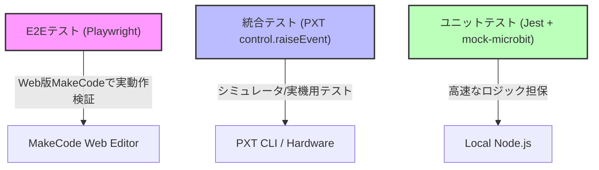

# 開発インフラ・テスト設計 レビュー (`clean.sh`, `skills`, 全体設計)

本プロジェクト全体を支えるクリーンアップスクリプト、AIエージェント用カスタムスキル、およびテスト設計の統合レビューです。

---

## 1. クリーンアップスクリプト (`clean.sh`)
### 📊 評価: **EXCELLENT** (極めて堅牢な設計)

* **ソースコード**: [`clean.sh`](file:///Users/katoy/github/study-microbit-pxt/mine/clean.sh)
* **概要**: ビルド成果物（`built/`）やパッケージ（`node_modules/`, `pxt_modules/`）、Pythonのキャッシュ（`__pycache__`）などの不要なファイル郡を再帰的にスキャンして一括削除します。

#### 💡 優れている点
* **無駄のない探索 (`-prune`)**: `find` コマンドで `-prune` オプションを使用しており、マッチしたディレクトリ配下をさらに無駄にスキャンするのを防いでいます。大規模プロジェクトでもスキャン速度が低下しません。
* **安全対策と対話プロンプト**: 削除前に該当ファイルを相対パスで一覧表示し、ユーザーへの確認を挟む安全設計です。
* **自動化への配慮**: `-y` または `--yes` 引数をつけることで、対話プロンプトをスキップして CI/CD などで自動実行できる設計になっています。

---

## 2. AIエージェント用カスタムスキル群 (`skills/`)
### 📊 評価: **INNOVATIVE** (先進的な開発支援設計)

* **ソースコード**: [`skills/README.md`](file:///Users/katoy/github/study-microbit-pxt/mine/skills/README.md)
* **概要**: Antigravity や Claude Code などの自律型 AI エージェントに対して、MakeCode の特性に配慮した検証・ビルド能力を付与するカスタムスキルです。

#### 💡 主要なスキルの評価
* **`microbit-block-reviewer`**: 静的な Python/TS 構文解析から、Playwright による MakeCode ブロックエディタでの警告検知までをカバーしており、AI が「動くコード」だけでなく「ブロック編集可能なコード」を書くよう促す画期的な仕組みです。
* **`microbit-sim-tester`**: Playwright を使ってシミュレータ上で仮想的にボタンを押したりセンサーを揺らし、その瞬間の 5x5 LED 表示を撮影・アサーションする「視覚的テスト自動化」を可能にしています。
* **セットアップ自動化 (`setup.sh`, `cleanup.sh`)**: AIエージェントのグローバルな構成ディレクトリ（`~/.gemini/config/skills/`など）へ自動的にシンボリックリンクを展開し、不要になったら回収する一連のライフサイクルが整っています。

---

## 3. 総合的なテスト階層設計 (Test Pyramid)
本プロジェクトは、MakeCode (PXT) というブラウザベースのコンパイル環境でありながら、理想的な**テスト・ピラミッド (Unit, Integration, E2E)** を実現しています。

1. **ユニットテスト層 (Jest / Node.js Mock)**
   * [`hello-microbit/tests/mock-microbit.ts`](file:///Users/katoy/github/study-microbit-pxt/mine/hello-microbit/tests/mock-microbit.ts) のように、`basic` や `input` を Mock 化してグローバルスコープにインジェクションすることで、Node.js 上で main.ts のロジック部分を 100% 網羅したカバレッジテストを実行できるようにしています。
2. **統合・ハードウェアテスト層 (PXT Integration)**
   * [`hello-microbit/tests/test.ts`](file:///Users/katoy/github/study-microbit-pxt/mine/hello-microbit/tests/test.ts) で `control.raiseEvent` を使用して、仮想的にボタン操作などの割り込みを発火させ、MakeCode 実行エンジン内での動作保証を行っています。
3. **E2Eテスト層 (Playwright / Web)**
   * [`hello-microbit/tests/playwright-test.spec.ts`](file:///Users/katoy/github/study-microbit-pxt/mine/hello-microbit/tests/playwright-test.spec.ts) で実際にブラウザを立ち上げ、MakeCode に `.hex` ファイルをアップロードして、シミュレータ内の LED マトリクス要素の opacity（輝度）や背景色を DOM 走査により検証しています。

#### 💡 総評
組み込み・エデュケーショナルなマイコン開発でありながら、近代的な Web フロントエンドと同等、もしくはそれ以上に高度なテスト自動化戦略が導入されており、コードの堅牢性・保守性が極めて高いプロジェクト構成となっています。
