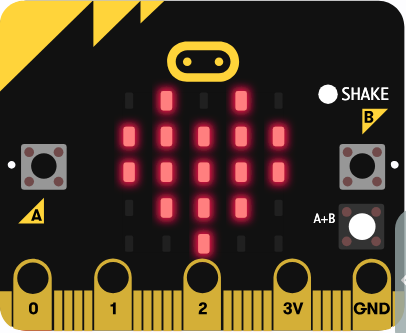
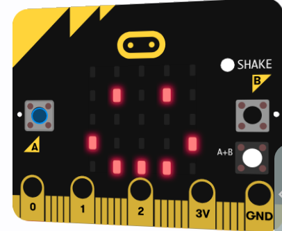
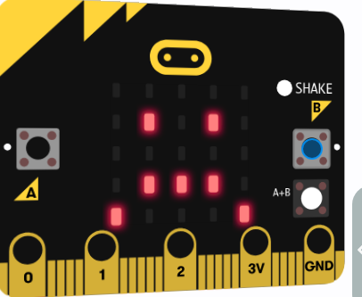
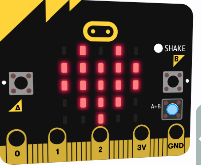
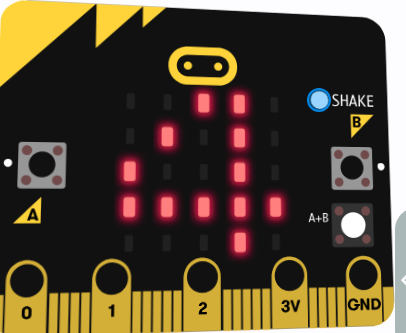
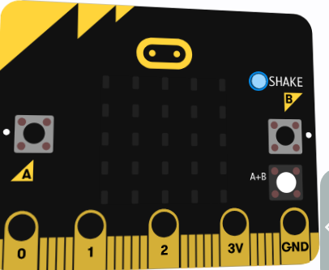
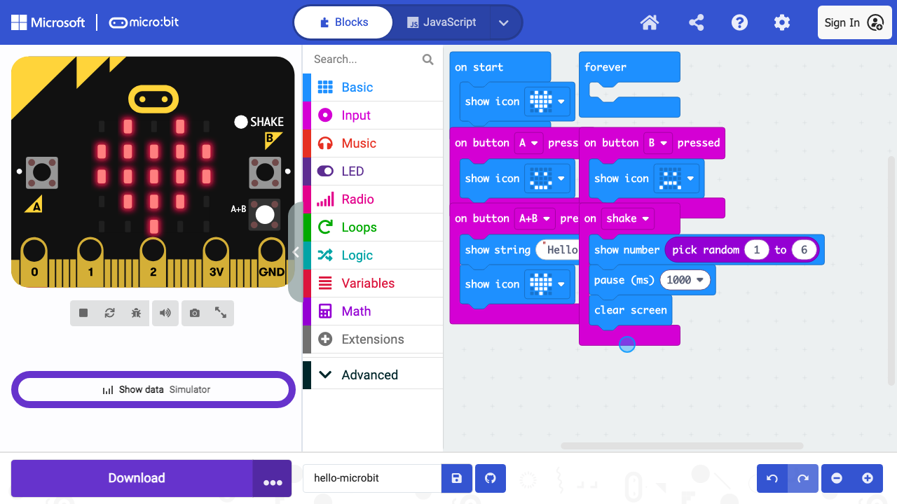

# hello-microbit

MakeCode micro:bit (PXT) の TypeScript プロジェクトです。ボタン操作やジェスチャー（シェイク）に応じて、LED マトリクス上にアイコン、文字列、およびランダム数値（サイコロ）を表示します。

---

## 📋 目次 (TOC)

- [🎬 デモ動画・スクリーンショット](#demo)
- [🧭 仕様・動作イベント一覧](#specification)
- [📁 ディレクトリ構成](#directory-structure)
- [🛠️ 開発・ビルド手順](#development-and-build)
  - [1. 依存パッケージのインストール](#1-依存パッケージのインストール)
  - [2. PXT ターゲットの設定](#2-pxt-ターゲットの設定)
  - [3. ローカル開発サーバーの起動](#3-ローカル開発サーバーの起動)
  - [4. プロジェクトのビルド](#4-プロジェクトのビルド)
  - [5. main.blocks の同期と注意点](#5-mainblocks-の同期と注意点)
- [🧪 テスト・検証実行方法](#testing)
  - [1. すべてのテストを一括実行 (推奨)](#1-すべてのテストを一括実行-推奨)
  - [2. 個別テストの実行](#2-個別テストの実行)
- [📊 カバレッジ計測結果表示方法](#coverage)
- [🤖 AI Agent スキルの活用プロンプト例](#ai-agent-prompts)

---

## <a id="demo"></a>🎬 デモ動画・スクリーンショット

### デモ動画 (シミュレータ動作確認テスト)

E2Eテストで動作確認を行っている様子（WebM形式）です。

<video src="screenshots/demo.webm" width="640" controls muted autoplay loop></video>

### 主なスクリーンショット (シミュレータの表示状態)

| 起動時 (ハート) | Aボタン (笑顔) | Bボタン (悲しい顔) |
| :---: | :---: | :---: |
|  |  |  |

| A+Bボタン (スクロール終了) | ゆさぶられたとき (サイコロ) | 画面消去後 |
| :---: | :---: | :---: |
|  |  |  |

### エディタ開発画面

MakeCode エディタに `.hex` ファイルを読み込ませた直後の画面レイアウトです。



### Python インポートのデモ

Python ファイルを MakeCode 内にロードした際の自動コンパイルとテスト動画です。

<video src="screenshots/import_python_demo.webm" width="640" controls muted></video>

---

## <a id="specification"></a>🧭 仕様・動作イベント一覧

入力イベント（ボタン操作・ジェスチャーなど）に応じて、以下の動作を行います。

| トリガー / イベント | 動作概要 | 表示内容 (`MakeCode API`) |
|---|---|---|
| 起動時 (On Start) | LED マトリクスにハートアイコンを表示します。 | `basic.showIcon(IconNames.Heart)` |
| Aボタン押下 | LED マトリクスに笑顔アイコンを表示します。 | `basic.showIcon(IconNames.Happy)` |
| Bボタン押下 | LED マトリクスに悲しい顔アイコンを表示します。 | `basic.showIcon(IconNames.Sad)` |
| A+Bボタン同時押下 | 「Hello!」とスクロール表示したあと、ハートアイコンに戻ります。 | `basic.showString("Hello!")` ➔ `basic.showIcon(IconNames.Heart)` |
| ゆさぶられたとき (Shake) | 1〜6のランダムな数字（サイコロ）を 1 秒間表示したあと、画面を消去します。 | `basic.showNumber(randint(1, 6))` ➔ `basic.pause(1000)` ➔ `basic.clearScreen()` |

---

## <a id="directory-structure"></a>📁 ディレクトリ構成

```text
hello-microbit/
├── main.ts              <-- メインプログラムコード (MakeCode PXT 用)
├── main.blocks          <-- ブロックエディタ用の同期ファイル (Blockly XML)
├── pxt.json             <-- PXT プロジェクト設定ファイル
├── package.json         <-- npm パッケージ・スクリプト定義
├── test.sh              <-- テスト一括実行シェルスクリプト
├── screenshots/         <-- デモ動画・スクリーンショット格納フォルダ
├── tests/
│   ├── test.ts              <-- PXT 標準テスト
│   ├── coverage.test.ts      <-- Jest 単体テスト (カバレッジ計測用)
│   ├── mock-microbit.ts      <-- micro:bit API モック
│   ├── playwright-test.spec.ts <-- Playwright E2E シミュレータテスト
│   └── import-python.spec.ts  <-- MakeCode Python インポート検証 E2E テスト
└── README.md            <-- 本ドキュメント
```

---

## <a id="development-and-build"></a>🛠️ 開発・ビルド手順

### 1. 依存パッケージのインストール

```bash
npm install
```

### 2. PXT ターゲットの設定

```bash
npx pxt target microbit
```

### 3. ローカル開発サーバーの起動

MakeCode のブロックエディタをローカルで起動して開発・確認を行えます。

```bash
npx pxt serve
```

ブラウザ上でブロックやコードを編集すると、ローカルファイルの `main.blocks` および `main.ts` が自動的にリアルタイムで同期・更新されます。

### 4. プロジェクトのビルド

micro:bit 実機や MakeCode エディタへインポートするための `.hex` ファイルを作成します（E2E テストの事前準備としても必要です）。

```bash
npx pxt build
```
ビルド完了後、`built/binary.hex` が生成されます。

### 5. main.blocks の同期と注意点

テキストエディタで `main.ts` を直接変更した場合、ローカルの `main.blocks` は自動同期されません。
`npx pxt serve` を実行中にしてブラウザで開くか、生成された `.hex` ファイルを MakeCode エディタに再インポートすることで `main.blocks` が最新化されます。

> [!IMPORTANT]
> ブロックエディタと双方向同期する場合は、MakeCode が標準サポートする文法で記述してください。高度なクラス定義やサポート対象外の TypeScript 構文を使用すると、ブロック変換時にグレーブロック化したりエラーになる場合があります。

---

## <a id="testing"></a>🧪 テスト・検証実行方法

このプロジェクトには 3 種類のテスト環境が統合されています。

### 1. すべてのテストを一括実行 (推奨)

以下のいずれかのコマンドを実行すると、「PXT標準テスト ➔ ビルド ➔ E2Eテスト ➔ カバレッジ計測」が順番に自動実行されます。

```bash
npm test
# または
./test.sh
```

### 2. 個別テストの実行

#### PXT 標準ユニットテスト
`tests/test.ts` に記述された PXT の挙動・ロジックテストを実行します。
```bash
npm run test:pxt
```

#### Playwright E2E シミュレータテスト
Playwright を使用してブラウザ上の MakeCode シミュレータにビルドした `.hex` ファイルをロードし、ボタンクリックやシェイクなどのイベントに対する動作を検証します。
```bash
npm run test:e2e
```

#### Jest コードカバレッジ計測テスト
micro:bit API をモックし、`main.ts` に対する C0/C1 カバレッジを Jest で計測します。
```bash
npm run test:cov
```

---

## <a id="coverage"></a>📊 カバレッジ計測結果表示方法

`npm run test:cov`（または `npm test`）を実行すると、ターミナル上にコードカバレッジ結果が表示されます。

- **Mac で HTML カバレッジレポートを開く場合**:
  ```bash
  open coverage/index.html
  ```

---

## <a id="ai-agent-prompts"></a>🤖 AI Agent スキルの活用プロンプト例

### 1. 簡素な例 (ワンライナー指示)

- **ブロック互換性チェック**: `microbit-block-reviewer` で `main.ts` の互換性を検証して
- **ビルド＆エディタ表示**: `microbit-build-and-open` で `.hex` をビルドし MakeCode で開いて
- **シミュレータ検証**: `microbit-sim-tester` で Aボタンや Bボタンの動作と LED 表示のスクショを撮って

### 2. 詳細な例 (条件・目的を明確にした指示)

- **ブロック互換性チェック**:
  > `main.ts` について、MakeCode ブロックエディタで非対応となる構文やグレーブロックになる記述がないか `microbit-block-reviewer` スキルで検証し、改善案を提示してください。

- **ビルド＆エディタ表示**:
  > `npx pxt build` を実行して `built/binary.hex` を生成し、`microbit-build-and-open` スキルを使って MakeCode エディタに読み込ませて開発環境を準備してください。

- **シミュレータ検証**:
  > `microbit-sim-tester` スキルを使って MakeCode シミュレータ上で Aボタン、Bボタン、A+Bボタン押下およびシェイクイベントを発火させ、LED マトリクスの表示結果をスクリーンショット撮影して検証してください。

